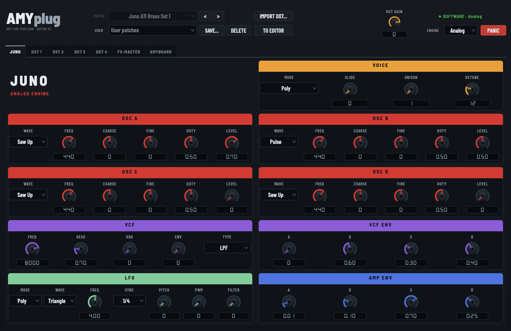
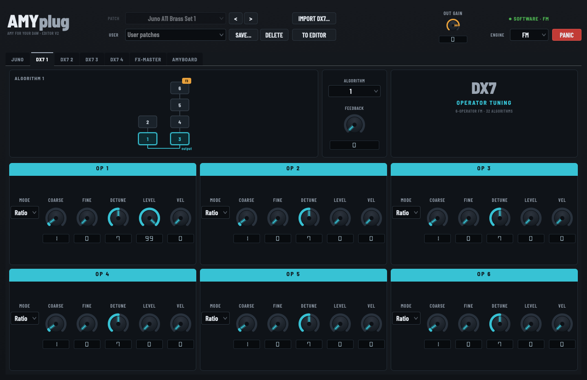
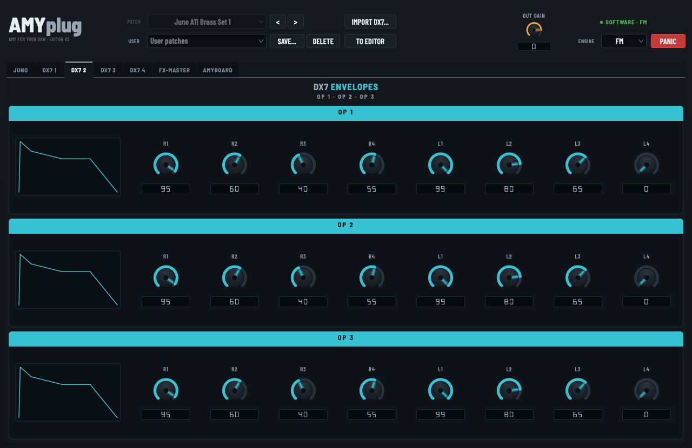
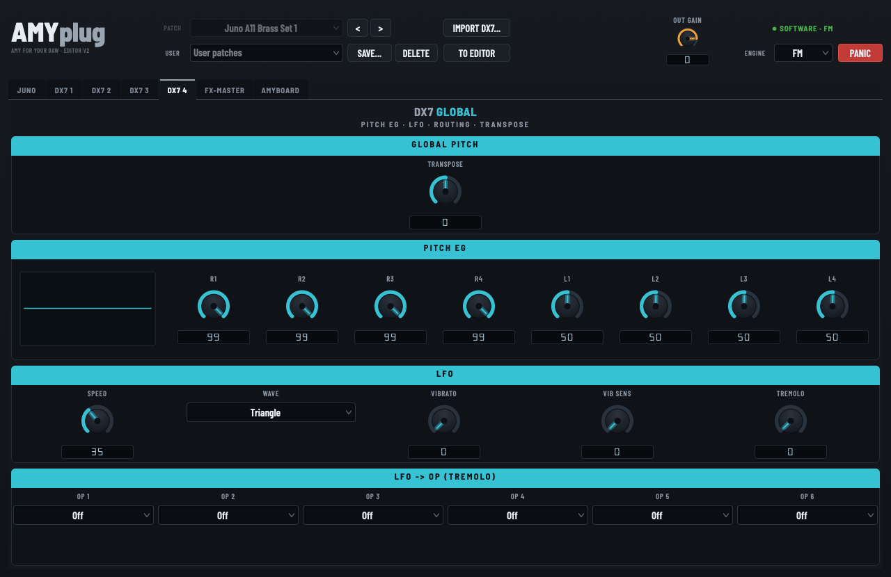
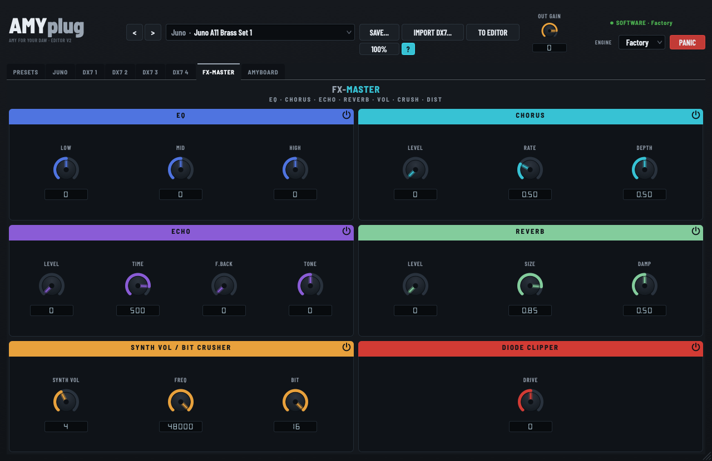
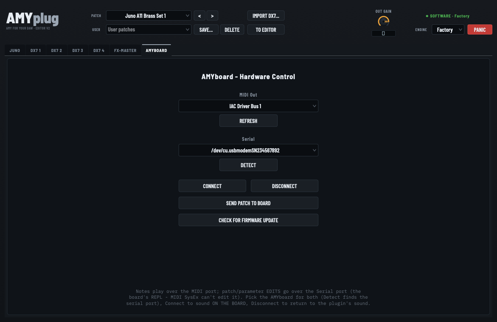
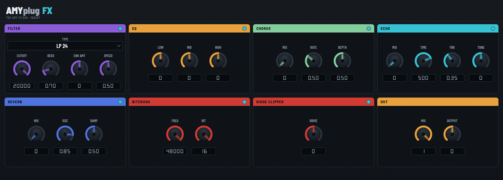

# AMYplug

**A free, open-source AU / VST3 instrument plugin that puts the [AMY synthesizer](https://github.com/shorepine/amy) inside your DAW — and can also drive a real [AMYboard](https://amyboard.com) as hardware.**

AMYplug loads AMY as a normal instrument: play it live, design and save patches, automate every knob, and have the whole sound recall perfectly with your project. It’s the first AMY plugin to exist.

**Two plugins, one download:** the **AMYplug** instrument, and **AMYplugFX** — AMY’s complete filter and effects bus (plus a bit crusher and a diode-clipper saturator) as a standalone insert effect for any track.

- **macOS** · Audio Unit + VST3 + Standalone · Apple Silicon & Intel · macOS 11+
- License: **AGPL-3.0** (it links JUCE). AMY’s own C engine is MIT.



---

## ⚠️ Read this first: one instance makes sound at a time

**AMY is a single global engine** — there is one of it per host process, not one per plugin instance. So **only one AMYplug can be sounding at any moment**, no matter how many you load. This is a property of AMY itself, not a bug or a licensing limit.

Load a second AMYplug and it deliberately stays **silent** rather than fighting over the engine (two renderers would corrupt each other’s voices and double-pull the sample clock). Its header shows:

> ○ **SILENT · engine in use by another instance**

…next to a **USE ENGINE HERE** button. Click it and the engine moves to that instance immediately — the other one falls silent. That’s the fast way to hop between two AMYplugs while designing sounds; no rendering required.

**To actually keep several AMYplug parts in one project:** finish a part, **bounce/freeze that track to audio**, then **remove the plugin instance** — and only then load the next one.

> **Important:** *bypassing is not enough.* A bypassed instance still holds the engine. It’s released when the instance is **removed**, when it’s switched to **Hardware** mode, or when another instance takes it with **USE ENGINE HERE**.

**Nothing is lost while an instance is silent.** Every instance keeps its own complete state — patch, all parameters, engine choice — saved with your DAW project and restored on reload, whether or not it owned the engine. Your **user patches are stored on disk** (`~/Library/Application Support/AMYplug/Patches/`), so they’re shared by every instance and survive across projects. A silent instance is idle, not amnesiac.

**The same rule applies to Hardware mode:** there’s one physical AMYboard, so one instance owns it. The others show “board in use by another AMYplug instance” and stay idle until it’s freed.

---

## Two modes

| Mode | What makes the sound | When to use it |
| ---- | -------------------- | -------------- |
| **Software** (default) | AMY’s C engine compiled into the plugin, rendered right in your DAW | Everyday use. Full host automation, sample-accurate recall, and **no hanging notes** — the plugin owns every note on/off. |
| **Hardware** | A physical **AMYboard** over USB-MIDI; the plugin is the editor/librarian | Play and edit real AMYboard hardware from your DAW. The plugin sends silence; you record the board’s audio through your interface. |

---

## Install — the easy way (no coding)

1. **Download** the latest `AMYplug-macOS.zip` from the [**Releases page**](https://github.com/Mando-369/AMYplug/releases).
2. **Unzip** it. You’ll get the **AMYplug** instrument (`.component` / `.vst3`), the **AMYplugFX** effect (`.component` / `.vst3`), an optional `AMYplug.app` (Standalone), and `install.sh`.
3. **Run the installer.** Open **Terminal**, type `cd ` (with a trailing space), drag the unzipped folder onto the Terminal window, press Return, then run the script:
   ```bash
   cd /path/to/AMYplug-macOS
   ./install.sh
   ```
   It copies the AU + VST3 into your user plug-in folders and clears macOS’s Gatekeeper quarantine so your DAW will load them.
   - Want the standalone app too? `./install.sh --standalone`
   - To remove everything later: `./install.sh --uninstall`
4. **Restart your DAW** (or rescan plug-ins). AMYplug appears as an instrument by **Mando369**.

> **Why the installer, and why Gatekeeper?** The plugins are *ad-hoc signed*, not notarized by Apple, so a downloaded copy is quarantined and macOS may say it “can’t be opened” or “is damaged.” That’s not a real problem — the installer runs `xattr -dr com.apple.quarantine` and re-signs locally, which is the standard fix. To do it by hand, see [Troubleshooting](#troubleshooting).

**Manual install** (if you’d rather not use the script): copy `AMYplug.component` to `~/Library/Audio/Plug-Ins/Components/` and `AMYplug.vst3` to `~/Library/Audio/Plug-Ins/VST3/`, then run `xattr -dr com.apple.quarantine` on each.

---

## Install — build it yourself (developers)

Requires Xcode command-line tools, CMake ≥ 3.22, and git.

```bash
git clone https://github.com/Mando-369/AMYplug.git
cd AMYplug
./scripts/bootstrap.sh            # fetches the JUCE and AMY submodules
cmake --preset mac-release
cmake --build --preset mac-release
./scripts/install.sh              # installs what you just built
```

Run the tests / validation:
```bash
ctest --preset mac-release        # unit tests (Catch2)
auval -v aumu Amyp Mand           # AU validation
```

See [`CLAUDE.md`](CLAUDE.md) for the architecture brief and [`docs/`](docs/) for deeper notes.

---

## Quick start

1. Add **AMYplug** on an instrument track and play — it boots on a Juno-6 patch and makes sound immediately.
2. Open the editor. Use the **patch browser** at the top to pick any of AMY’s built-in sounds (Juno, DX7, piano, PCM…).
3. Switch tabs to edit per engine:
   - **Juno** — a full analog editor (OSC A/B, LFO, VCF + filter env, amp ADSR, effects).
   - **DX7** — a 6-operator FM editor; import your own `.syx` cartridges.
4. Tweak, then **Save…** to store a named user patch. Everything you change is host-automatable and recalls with the project.

---

## Features

- **All AMY engines** reachable, with proper per-engine editors for **Juno-style analog** and **DX7-style FM**.
- **Built-in patch browser** with real names (Juno 0–127, DX7 128–255, piano, PCM presets).
- **User patches** — save/load your own; organized by cartridge on import.
- **Import DX7 `.syx`** cartridges (32-voice bulk dumps) straight into the browser.
- **Voice modes**: Poly / Mono / **Legato** (true pitch-only slur with **glide/portamento**), plus **Unison** with detune.
- **Juno LFO** modes (Poly / Free / Key / Tempo-Sync).
- **AMY’s full FX bus** on the master — EQ, chorus, echo and reverb.
- **Two extra output effects of our own**, on top of AMY’s bus: a **Bit Crusher** (independent sample-rate + bit-depth reduction) and a **Diode Clipper** — a wave-digital-filter model of an antiparallel diode pair, for analog-style saturation rather than generic distortion. Both are Faust ports, and both are automatable like everything else.
- **A second plugin included — [AMYplugFX](#amyplugfx--the-synths-whole-fx-bus-as-an-effect-plugin)**: the entire output section (filter + EQ + chorus + echo + reverb + bit crusher + diode clipper) as an AU/VST3 **audio effect** you can insert on *any* track. Unlike the instrument, you can run as many of these as you like.
- **Full host automation** of every sound parameter, with **bit-faithful recall** — the plugin keeps a canonical patch model that saves and restores with your DAW project.
- **No hanging notes**: deterministic note-off, transport-stop flush, and a Panic button.
- **Hardware mode** to drive a real AMYboard (see below).

---

## The interface, tab by tab

Everything above the tabs is always visible: the **patch browser** (factory presets + your own user patches, with Import DX7 and “To Editor”), the **OUT GAIN** master, an **engine indicator** showing whether you’re hearing Software or Hardware, the **engine selector**, and **PANIC**.

### Juno — the analog engine


A full Juno-106-style voice. **OSC A–D** are the audio oscillators (wave, frequency, coarse/fine tuning, pulse width, level). **VCF** is the analog filter — cutoff, resonance, keyboard tracking, envelope amount and type — driven by its own **VCF ENV**, while **AMP ENV** shapes the level. **LFO** has selectable mode (Poly / Free / Key / Tempo-Sync), wave and rate, plus separate depths for pitch, PWM and filter. **VOICE** sets Poly / Mono / Legato, glide, and unison with detune.

> Parameter-by-parameter mapping to the real Juno-106 (and what AMY does with each) is in [`docs/JUNO_PARAMETERS.md`](docs/JUNO_PARAMETERS.md).

### DX7 1 — algorithm & operator tuning



Pick one of the **32 FM algorithms** and the diagram redraws to show which operators modulate which — modulators stacked above the carriers they feed, feedback marked. **Feedback** sets how hard the algorithm’s feedback operator drives itself. Below, each of the six operators gets its DX7-native tuning: **Coarse**, **Fine**, **Detune**, output **Level**, **Vel** (velocity sensitivity) and ratio/fixed **Mode**.

### DX7 2 & 3 — operator envelopes



Each operator has the DX7's 4-stage rate/level envelope (**R1–R4**, **L1–L4**), drawn live as a curve so you can see the shape you're dialling in. Operators 1–3 live on **DX7 2**, operators 4–6 on **DX7 3** — same layout on both.

### DX7 4 — global pitch, LFO & routing



**Transpose**, the **Pitch EG** (its own 4-stage envelope applied to all operators), and the patch **LFO** — speed, wave, vibrato depth and sensitivity, tremolo — plus the per-operator switches for which operators the LFO's tremolo actually reaches.

### FX-Master — the output section



Shared by both engines: **EQ** (low/mid/high), **Chorus** (level/rate/depth), **Echo** (level/time/feedback/tone) and **Reverb** (level/size/damping) — these are AMY’s own bus effects. Then the two host-side effects: **Bit Crusher** (sample rate + bit depth) and the **Diode Clipper**, a wave-digital-filter diode saturator whose **Drive** you push against **Synth Vol**, the level feeding it.

### AMYboard — hardware control



Only needed if you own the hardware. Pick the board's **MIDI** port (notes) and **Serial** port (patch/parameter edits — **Detect** finds it), **Connect** to hand sound-making over to the board, **Send Patch to Board** to push the current patch, and **Check for Firmware Update** to compare the board's build against the latest release. The status line always states plainly what's making sound.

---

## Hardware mode (driving a real AMYboard)

Full guide: [`docs/HARDWARE_MODE.md`](docs/HARDWARE_MODE.md).

Short version:
1. Connect the AMYboard by USB. In the plugin, switch to **Hardware** and pick the board’s **MIDI** port and **Serial** port (use **Detect**).
2. **Notes** are sent over USB-MIDI; **patch/parameter edits** go over the board’s serial REPL (the plugin handles both).
3. The plugin outputs silence in this mode — record the **board’s** audio through your interface.
4. **Check for Firmware Update** reads the board’s build over USB and compares it to the latest AMYboard release on GitHub. AMYboard firmware is a *rolling* release (no version number — a `YYYYMMDD-<hash>` build id), so it reports “up to date” or shows the newer build with a link to the [WebSerial flasher](https://amyboard.com/editor). It never flashes for you. See [`docs/FIRMWARE_UPDATE_CHECK.md`](docs/FIRMWARE_UPDATE_CHECK.md).

> ### 🌐 Heads-up: one optional internet request
> Pressing **Check for Firmware Update** is the **only** time AMYplug talks to the internet — it makes a single HTTPS `GET` to the **public GitHub Releases API** (`api.github.com/repos/shorepine/tulipcc`) to read the latest firmware’s date + commit hash. No account, no token, and **no data about you or your project is sent** (just a `User-Agent: AMYplug` header). Nothing happens unless you click the button. Everything else in the plugin — audio, patches, editing, saving — is **100% offline**.

> ### ⚠️ If hardware audio ever sounds glitchy, “bitcrushed,” or drifts in pitch/latency — **CHECK YOUR AUDIO MASTER CLOCK FIRST.**
> A misconfigured macOS **Aggregate Device** (two interfaces with bad *drift correction*) causes exactly these symptoms, **intermittently**, and it will masquerade as a board or plugin bug. Use your interface directly on its own clock, or set a single clock master. This cost us a full debugging session — don’t repeat it. Details in [`docs/HARDWARE_LATENCY.md`](docs/HARDWARE_LATENCY.md).

---

## AMYplugFX — the synth’s whole FX bus as an effect plugin

The download also includes **AMYplugFX**, an AU/VST3 **audio effect** that is AMYplug’s complete output section, usable as an insert on *any* track. Its DSP is extracted from AMY itself (engine-free, so any number of instances run independently), in the synth’s exact signal order:

**Filter → EQ → Chorus → Echo → Reverb → Bitcrush → Diode Clipper → Output**



- **Filter** — AMY’s analog VCF (LP 24/12, HP, BP) with cutoff/reso and an **envelope follower** so it opens with input level.
- **EQ** — 3-band (800 / 2500 / 7000 Hz), **Chorus**, **Echo** (time/feedback/tone), **Reverb** (size/damp) — the same AMY bus effects the instrument uses.
- **Bitcrush** + **Diode Clipper** — the Faust output-stage DSP (the diode is driven non-compensated here, so pushing Drive clips hotter/louder).
- Each effect has a **bypass toggle** in its title bar; every control is host-automatable.

It’s especially handy in **Hardware mode**: the instrument outputs silence, so insert AMYplugFX on the **AMYboard’s audio-return track** to process the board’s sound with the same effects.

---

## Troubleshooting

- **“AMYplug can’t be opened” / “is damaged”** → Gatekeeper quarantine. Run the installer, or by hand:
  ```bash
  xattr -dr com.apple.quarantine ~/Library/Audio/Plug-Ins/Components/AMYplug.component
  xattr -dr com.apple.quarantine ~/Library/Audio/Plug-Ins/VST3/AMYplug.vst3
  ```
- **Plugin doesn’t show up** → rescan plug-ins in your DAW. For AU, first-scan validation can take a moment; force it with `auval -v aumu Amyp Mand`. Logic caches AU results — quit and reopen if needed.
- **No sound in Software mode** → check the track isn’t muted and the plugin’s master volume is up; try loading a bright patch (e.g. a Juno lead) from the browser.
- **Hardware mode is glitchy / laggy / pitch-drifting** → see the master-clock warning above. Then confirm the board plays cleanly from [amyboard.com/editor](https://www.amyboard.com/editor/) to isolate board vs. host.
- **Wrong architecture** → if the release build won’t load, build from source for your machine.

---

## Requirements

- macOS 11 (Big Sur) or newer, Apple Silicon or Intel.
- Any AU or VST3 host (Ableton Live, Logic, Reaper, Bitwig, Cubase, GarageBand, …), or run the Standalone app.
- **Hardware mode** additionally needs an **[AMYboard](https://www.amyboard.com/)** connected by USB.

---

## Support

AMYplug is free and open source, and it stays that way. If it’s useful to you and you’d like to say thanks:

[**☕ Buy me a coffee on Ko-fi**](https://ko-fi.com/mand0369)

Entirely optional — bug reports and patches are just as welcome.

---

## License & credits

The plugin links **JUCE 8** (free license: AGPLv3), so any distributed binary is **AGPL-3.0** — see [`LICENSE`](LICENSE). AMYplug’s own first-party sources are additionally offered under MIT where noted, but any binary that includes JUCE must comply with AGPL-3.0. Bundled **AMY** remains MIT and is kept as an unmodified submodule. Full third-party breakdown in [`NOTICES.md`](NOTICES.md).

- [AMY](https://github.com/shorepine/amy) by DAn Ellis & Brian Whitman / Shore Pine Sound Systems (MIT).
- [AMYboard](https://amyboard.com) hardware · [shorepine/tulipcc](https://github.com/shorepine/tulipcc).
- Built with [JUCE](https://juce.com) (AGPLv3).
- **AMYplugFX DSP** — the filter, EQ, chorus, echo and reverb are extracted from AMY (MIT) into `src/amyfx/`; the bitcrusher and WDF diode clipper are ported from [Faust](https://faust.grame.fr) under the **STK-4.3** license (`ba.bitcrusher` by Julius O. Smith III, `ba.downSample` by Romain Michon, diode WDF model by Dirk Roosenburg, `KalosSoftClipper.dsp` by Thomas Mandolini). Full attribution in [`NOTICES.md`](NOTICES.md); STK text in [`licenses/STK-4.3.txt`](licenses/STK-4.3.txt).

### How this was built

AMYplug is, so far, a **hybrid human/AI project**. It’s directed, specified and tested by a human — every sound-affecting change is verified by ear, and the hardware behaviour was confirmed against a real AMYboard — with the implementation written in collaboration with **Claude** (Anthropic), working from the brief in [`CLAUDE.md`](CLAUDE.md) and the research notes in [`docs/`](docs/).

Mentioning it because it’s honest and because it shapes the codebase: the docs are unusually thorough (they’re the shared context), and the design decisions and their reasoning are recorded rather than assumed. Bugs are still bugs — please [report them](https://github.com/Mando-369/AMYplug/issues).

This is an independent community project and is **not** affiliated with or endorsed by Shore Pine Sound Systems.

Repo: https://github.com/Mando-369/AMYplug — issues and PRs welcome.
